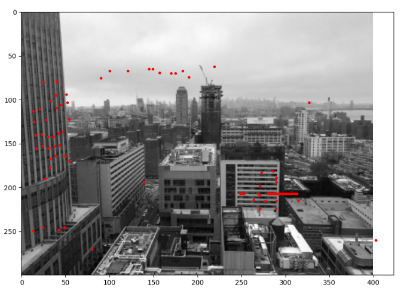
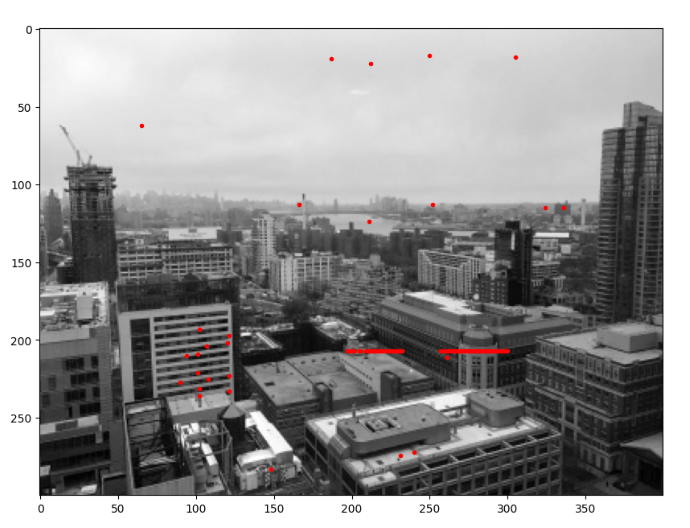
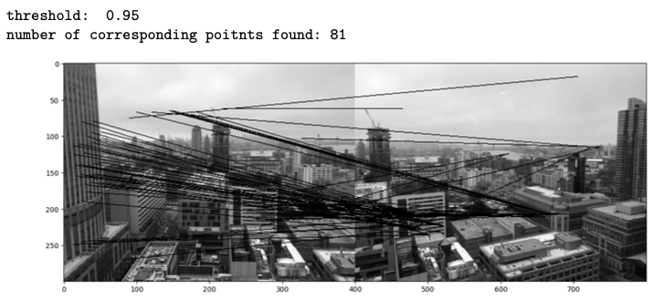
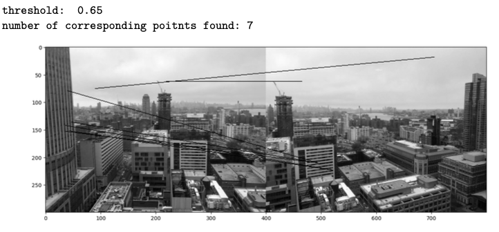
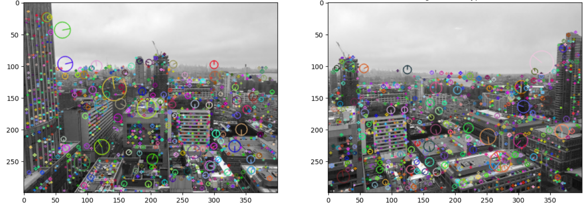
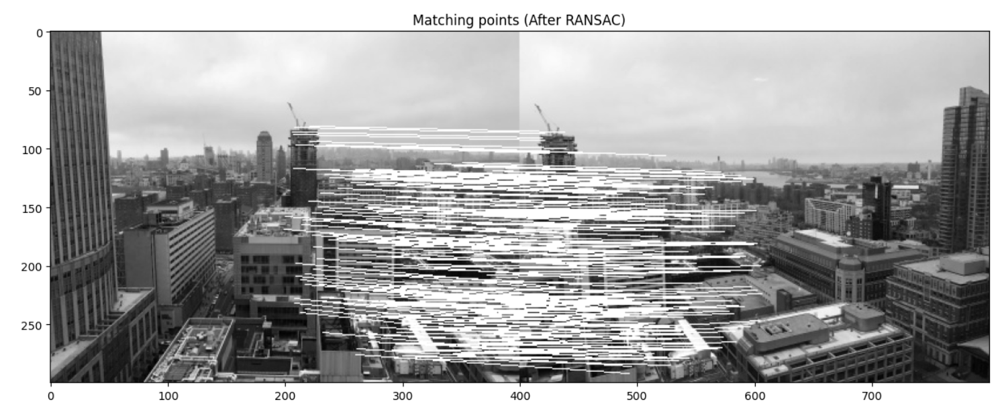
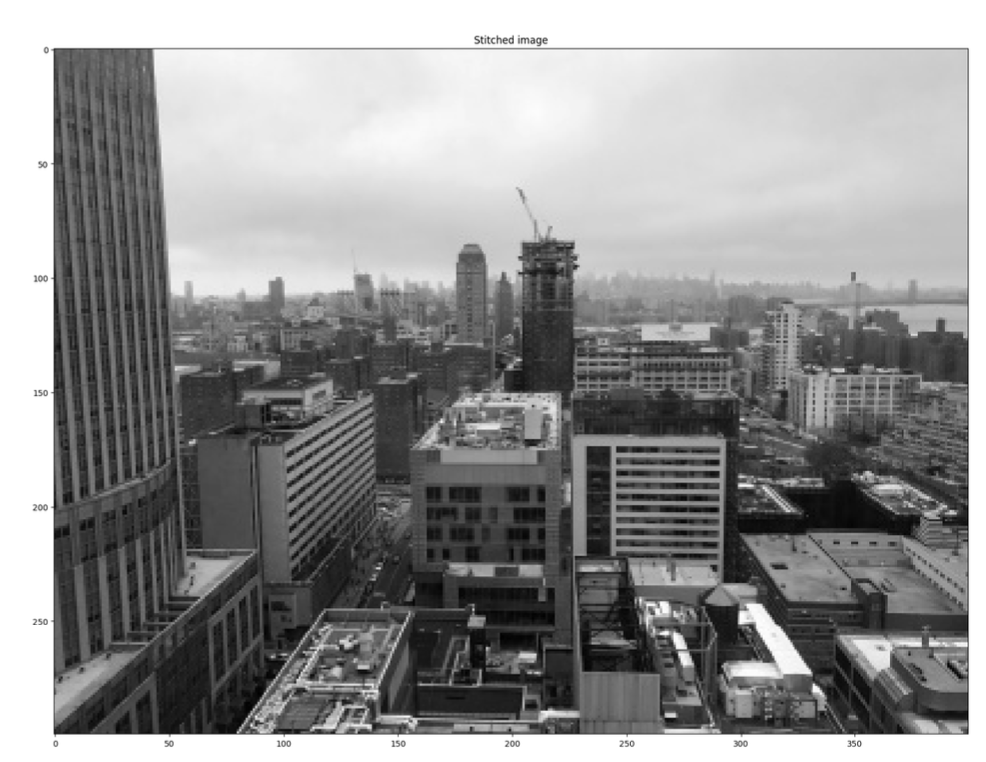

# Panorama Stitching

In this project, we employed the OpenCV implemented keypoint detector and feature descriptor to perform panorama stitching.

First, we tried to find the correspondence between the keypoints from a pair of images using a SIFT descriptor as below:

Next, we measure the closeness between 2 SIFT features using L2 norm. We experimented on different thresholds for the matching and visualize the correspondence by connecting the matched feature points across images. An example result is as below:

In the end, we employed the OpenCV implemented keypoint detector and feature descriptor to perform panorama stitching. We have two images taken from the same position but with different camera orientations. In this case, the two images are related by a homography mapping even though the imaged scene is not a plane. For this task, we used the SIFT feature detector to visualize the detected keypoints along with its meaningful scale in the images using the OpenCV function cv2.drawKeypoints():

For feature matching, we start with the simple feature matching approach to get the initial set of candidate matches. 

Finally, based on the homography we found from the robustly matched keypoints using RANSAC, we could perform warping to change the second images to align with the first one and stitch the 2 images captured from different views together. For blending, we will just simply overlay one image on top of the other for simplicity. 

The stitched image looked like:

